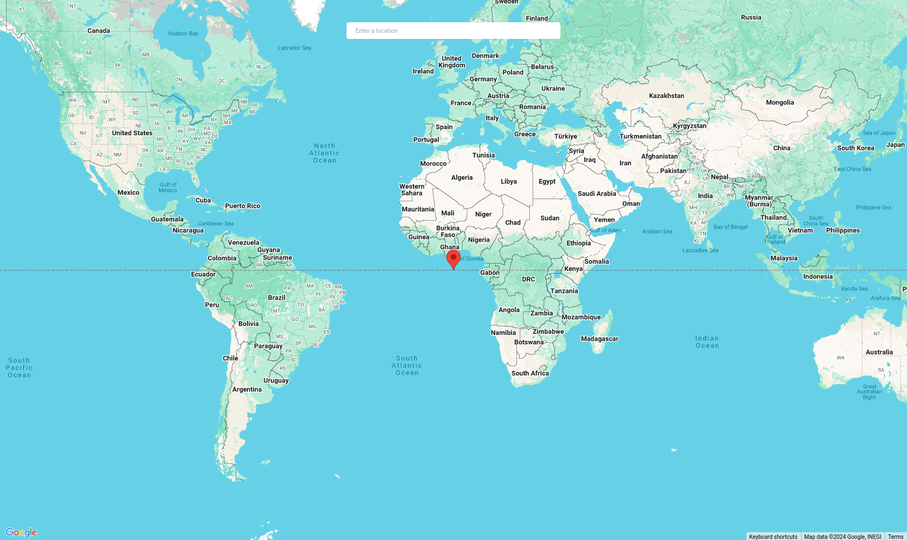

# React Google Map Location Picker

This is a basic example demonstrating the use of the Google Maps API to pick a location with automatic search completions. This can be used as a base template for those looking to collaborate and develop further.

## Features
- Location picking
- Automatic search completions

## Usage
This project is intended for people who need a drop-in solution for Google Maps autocomplete.

## Getting Started

- Install dependencies

```bash
pnpm add @vis.gl/react-google-maps
```

- Create Google Maps Api key - [refer docs](https://developers.google.com/maps/documentation/javascript/get-api-key#console)

- Copy paste the `src/gmaps-location-picker` directory into your codebase.

- You can start using the Location picker in your codebase

```tsx
import React from "react";
import GmapsLocationPicker from "./gmaps-location-picker";

export default function App() {
  const [place, setPlace] =
    React.useState<google.maps.places.PlaceResult | null>(null);
  return (
      <GmapsLocationPicker
        apiKey={"replace_with_your_api_key"}
        place={place}
        setPlace={setPlace}
        mapClassName="w-screen h-screen"
        inputClassName="mt-10 w-96 py-2 px-4 rounded"
      />
  );
}
```

# Output Screenshots



